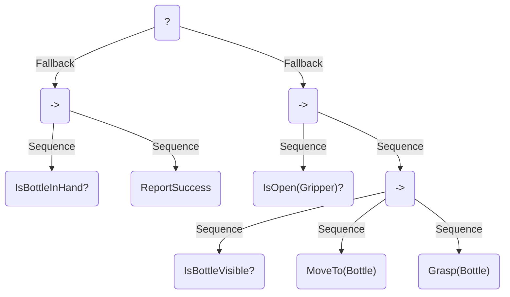

# Module 3: The Dynamics of Movement and Interaction

## 3.1 Introduction: The Challenge of Dynamic Motion

In the previous modules, we assembled the fundamental building blocks of a physical AI: the actuators that produce force, the sensors that perceive the world, and the control and software frameworks (ROS) that bind them together. We have a robot that can, in principle, sense and act. Now, we face the next great challenge: how do we make it *move* with the grace, stability, and purpose of a living creature?

This module is the technical core of our journey. We will dive into the complex dynamics of bipedal robotics and explore the high-level cognitive frameworks that enable autonomous behavior. We will cover:
-   **The Art of Balance**: Introducing the Zero-Moment Point (ZMP), the fundamental principle that allows humanoids to walk without falling.
-   **Whole-Body Coordination**: Moving beyond single joints to planning complex, collision-free movements for the entire robot using tools like MoveIt.
-   **Human-Robot Interaction (HRI)**: The principles behind making robots safe, predictable, and intuitive partners for humans.
-   **Physical AI Decision-Making**: Using Behavior Trees as a powerful framework for creating complex, autonomous, and reactive robot behaviors.

This chapter escalates the difficulty, moving from individual components to the holistic and dynamic systems that define modern robotics.

---

## 3.2 The Art of Balance: Gait and Stability

A walking human is a master of controlled falling. A humanoid robot must learn the same art.

### Static vs. Dynamic Stability
An object is **statically stable** if its center of gravity is located directly above its base of support (e.g., a table, or a person standing still). If you push it slightly, it will return to its stable position.

Humans and advanced humanoid robots, however, are **dynamically stable**. While walking, our center of gravity is often *outside* our support base. We are in a continuous state of falling forward, catching ourselves with each step. This is far more efficient but requires active, intelligent control.

### The Zero-Moment Point (ZMP)
The key to dynamic stability in bipedal locomotion is the **Zero-Moment Point (ZMP)**.

> **Definition**: The ZMP is the point on the ground surface where the total inertial forces and gravity forces acting on the robot have no net moment (i.e., they don't produce any rotation).

**Intuition**: You can think of the ZMP as the "center of pressure." To stay balanced, the robot must control its body in such a way that this center of pressure always remains within its **support polygon**—the area defined by its feet on the ground. If the ZMP moves outside this polygon, the robot will tip over.

A robot's "gait" or walking pattern is essentially a pre-planned trajectory for its center of mass and feet, carefully calculated to ensure the resulting ZMP stays within the support polygon at all times.

---

## 3.3 Hands-On: Simulating a Bipedal Gait with Webots

Implementing a true ZMP-based walking controller is a subject of advanced robotics research. However, we can achieve surprisingly effective walking motion using a simpler, biologically-inspired method called a **Central Pattern Generator (CPG)**. CPGs are neural circuits in animals that produce rhythmic outputs, like the flapping of wings or the motion of legs. We can simulate this with oscillating functions.

### Simulator Setup: Webots
For this exercise, we will use **Webots**, a powerful, open-source robotics simulator that is cross-platform and comes with many pre-built humanoid models.
1.  **Download and Install Webots**: Go to `https://cyberbotics.com` and download the latest version for your OS.
2.  **Launch Webots**: Open the application. You will be greeted with a menu.
3.  **Open the Humanoid World**: Go to `File -> Open World...` and navigate to the worlds directory within your Webots installation. Find and open `projects/robots/softbank/nao/worlds/nao_soccer.wbt`. This will load a world with a model of the popular Nao humanoid robot.

### The Locomotion Control Script
We will now write a Python controller that uses `sine` waves to generate a rhythmic walking motion for the Nao's legs.
1.  In Webots, go to `File -> New -> New Robot Controller...`.
2.  Select `Python` and give it a name like `nao_walker`.
3.  Replace the template code with the following script. This code is complex, but the comments will guide you through its logic.

```python
# nao_walker.py
# A simple CPG-based walking controller for the Nao robot in Webots.

from controller import Robot, Motor, InertialUnit
import math

class NaoWalker(Robot):
    def __init__(self):
        super(NaoWalker, self).__init__()
        self.time_step = int(self.getBasicTimeStep())

        # Get device handles
        self.imu = self.getDevice('inertial unit')
        self.imu.enable(self.time_step)

        # Get leg motors
        self.left_hip_yaw_pitch = self.getDevice('LHipYawPitch')
        self.left_hip_roll = self.getDevice('LHipRoll')
        self.left_hip_pitch = self.getDevice('LHipPitch')
        self.left_knee_pitch = self.getDevice('LKneePitch')
        self.left_ankle_pitch = self.getDevice('LAnklePitch')
        self.left_ankle_roll = self.getDevice('LAnkleRoll')

        self.right_hip_roll = self.getDevice('RHipRoll')
        self.right_hip_pitch = self.getDevice('RHipPitch')
        self.right_knee_pitch = self.getDevice('RKneePitch')
        self.right_ankle_pitch = self.getDevice('RAnklePitch')
        self.right_ankle_roll = self.getDevice('RAnkleRoll')

        # Central Pattern Generator (CPG) parameters
        self.walk_amplitude = 0.2  # rad
        self.walk_frequency = 1.0  # Hz
        self.time = 0.0

    def run(self):
        while self.step(self.time_step) != -1:
            self.time += self.time_step / 1000.0

            # --- CPG Oscillation Logic ---
            # Create a sine wave for the primary leg motion
            oscillation = math.sin(2.0 * math.pi * self.walk_frequency * self.time)
            
            # --- Apply Oscillations to Leg Joints ---
            # Hip Pitch (forward/backward motion)
            # The two legs are out of phase by 180 degrees (math.pi)
            left_hip_pitch_target = self.walk_amplitude * math.sin(2.0 * math.pi * self.walk_frequency * self.time)
            right_hip_pitch_target = self.walk_amplitude * math.sin(2.0 * math.pi * self.walk_frequency * self.time + math.pi)

            # Ankle Pitch (compensate for hip motion to keep feet flat)
            left_ankle_pitch_target = -left_hip_pitch_target
            right_ankle_pitch_target = -right_hip_pitch_target

            # Set motor positions
            self.left_hip_pitch.setPosition(left_hip_pitch_target)
            self.right_hip_pitch.setPosition(right_hip_pitch_target)
            self.left_ankle_pitch.setPosition(left_ankle_pitch_target)
            self.right_ankle_pitch.setPosition(right_ankle_pitch_target)

            # A small constant offset for knee and hip roll for stability
            self.left_knee_pitch.setPosition(0.1)
            self.right_knee_pitch.setPosition(0.1)
            self.left_hip_roll.setPosition(-0.05)
            self.right_hip_roll.setPosition(0.05)
            self.left_ankle_roll.setPosition(0.05)
            self.right_ankle_roll.setPosition(-0.05)
            
            # Keep head straight
            self.left_hip_yaw_pitch.setPosition(0.0)


# Create the controller instance and run it
controller = NaoWalker()
controller.run()
```
4.  **Assign the Controller**: In the scene tree on the left, select the `Nao` robot node. In the `controller` field, click `Select...` and choose your `nao_walker` controller.
5.  **Run the Simulation**: Save the world and press the "play" button. The Nao robot should start performing a basic walking motion on the spot. Experiment with the `walk_amplitude` and `walk_frequency` values to see how the gait changes!

---

## 3.4 Whole-Body Coordination and Motion Planning

Walking is just one task. What if a robot needs to open a door? It must walk to the door, extend its arm, grasp the handle, and turn it, all while maintaining balance. This requires **whole-body coordination**. The process of figuring out the sequence of joint movements to achieve such a task is called **Motion Planning**.

> **Definition**: Motion Planning is the process of finding a valid path for a robot from a starting configuration to a goal configuration, while avoiding collisions with itself and the environment.

### The Standard Tool: MoveIt for ROS 2
In the ROS ecosystem, the gold standard for motion planning is **MoveIt**. It's a powerful framework that connects to your robot model and provides everything you need to perform complex motion planning.
-   **Robot Model (URDF/SRDF)**: MoveIt uses a detailed XML-based description of your robot's links and joints (the URDF) and a semantic description of its joint groups and capabilities (the SRDF).
-   **Collision Checking**: It builds a 3D model of the robot and the environment to check if a given configuration is in collision.
-   **Planning Libraries (OMPL)**: It integrates state-of-the-art planning algorithms (from the Open Motion Planning Library) to find collision-free paths.

### Hands-On: Motion Planning with MoveIt
This exercise assumes you have ROS 2 Humble installed (from Module 2). We will install MoveIt and use a pre-built demo for the Panda robot arm.
1.  **Install MoveIt and Demos**:
    ```bash
    sudo apt install ros-humble-moveit
    sudo apt install ros-humble-moveit-resources-panda-moveit-config
    ```

2.  **Launch the Demo**:
    ```bash
    ros2 launch moveit_resources_panda_moveit_config demo.launch.py
    ```
    This command will launch two applications: **RViz**, the ROS 2 visualization tool, and the MoveIt motion planning server.

3.  **Interact in RViz**:
    - In RViz, you will see a 3D model of the Panda arm.
    - In the "MotionPlanning" panel on the left, you'll see a draggable orange sphere representing the desired goal for the robot's end-effector.
    - Drag this sphere to a new location. You will see a "ghost" of the robot arm showing the goal configuration.
    - Click the **"Plan and Execute"** button.
    - You will see MoveIt plan a smooth, collision-free trajectory, and the robot model will execute the motion.

This interactive demo powerfully illustrates what a motion planner does. You provide a high-level goal, and MoveIt calculates the complex sequence of joint movements required to achieve it safely.

---

## 3.5 Physical AI Decision-Making

We can now make our robot move and walk, but how does it *decide* what to do? How does it sequence tasks to achieve a high-level objective like "get me a bottle of water"? This is the domain of AI decision-making.

While Finite State Machines (FSMs) are simple, they become incredibly complex and hard to manage for non-trivial tasks. A more modern and scalable solution is **Behavior Trees (BTs)**.

### Behavior Trees: A Framework for Decisions
A Behavior Tree is a tree of nodes that controls the flow of decisions for an AI. Each node "ticks" and returns a status: `Success`, `Failure`, or `Running`.
-   **Action Nodes (Leaves)**: These are the actual commands the robot executes (e.g., `WalkTo(kitchen)`, `Grasp(bottle)`, `MoveArm(pose)`).
-   **Condition Nodes (Leaves)**: These check a state of the world (e.g., `IsBottleVisible?`, `IsHandEmpty?`).
-   **Control Flow Nodes (Internal)**:
    -   **Sequence (`->`)**: Ticks its children in order. If any child fails, the sequence fails. It succeeds only if all children succeed. Used for sequential tasks.
    -   **Fallback/Selector (`?`)**: Ticks its children in order until one succeeds. If a child succeeds, the fallback succeeds. It fails only if all children fail. Used for contingency plans.

#### Example Behavior Tree
Here is a BT for a "Fetch water bottle" task:


This tree reads: "Is the bottle already in my hand? If so, report success. If not, is my gripper open? Then, is the bottle visible? Then, move to the bottle. Then, grasp the bottle."

BTs are powerful because they are modular, reactive, and easy to visualize, making them a standard for high-level decision-making in ROS 2, often using the `BehaviorTree.CPP` library.

---

## 3.6 Summary & What's Next

This module made a significant leap into the dynamic and cognitive aspects of humanoid robotics.
-   We learned that dynamic balance is governed by the **Zero-Moment Point (ZMP)** and simulated a basic walking gait using a **Central Pattern Generator (CPG)** in Webots.
-   We explored **whole-body coordination** and used **MoveIt** in ROS 2 to plan complex, collision-free movements for a robot arm.
-   We introduced **Behavior Trees** as a powerful and scalable framework for high-level AI decision-making.

You now understand not just the components of a robot, but the dynamic principles and cognitive architectures required to make them move and act with purpose.

In Module 4, we will explore the cutting edge of Physical AI: **learning from experience**. We will dive into Reinforcement Learning and Imitation Learning, exploring how a robot can acquire complex new skills entirely on its own.
